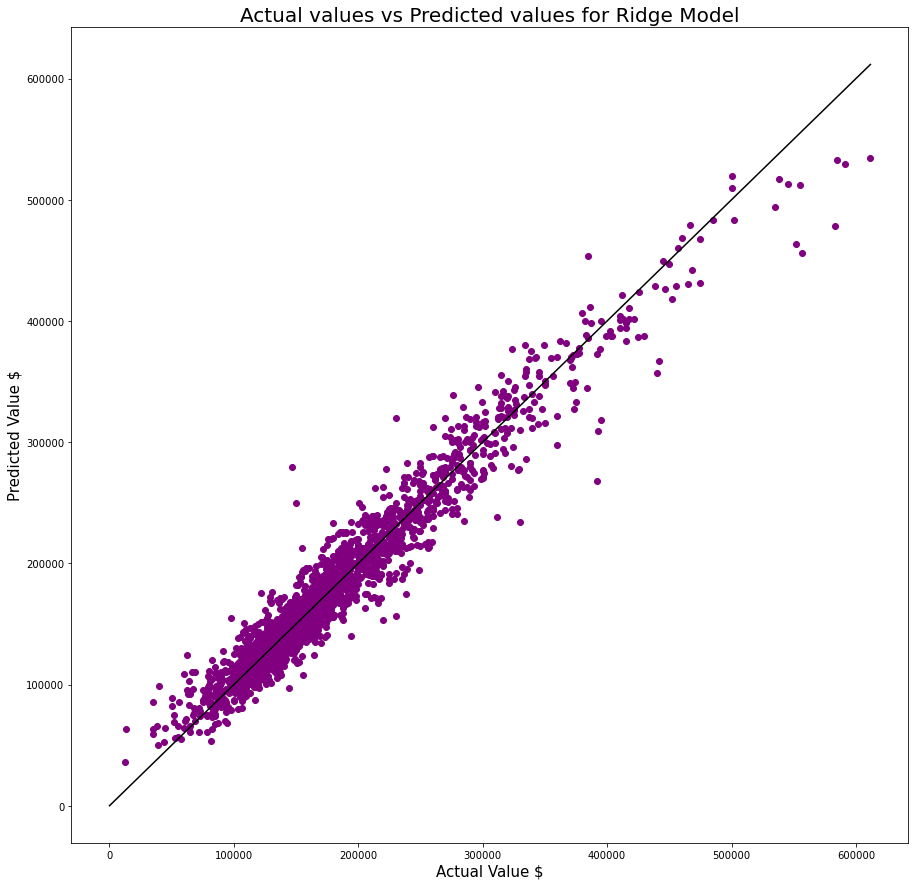

# **Kaggle Ames Housing Data Price Modeling Competition**

## **Overview**

The objective of this project is to create a model that can accurately predict housing prices using the AMES dataset. A part of this project is submitting our predictions to the Kaggle Competition to see how well our model predicts housing prices with the given data.

## **Problem Statement**

How can I create a model that most accurately predicts the prices of houses in Ames, Iowa with the given information.

## **Data Dictionary**

We were given documentation that explains what each of the features is in the dataset.

*http://jse.amstat.org/v19n3/decock/DataDocumentation.txt*

## **EDA/Cleaning**

Due to the limited dataset and nature of the competition, I decided that I could not drop any rows with null values. Therefore I had to figure out what to do with each of the features that had null values.

The features were presented in four different categories. Nominal, Ordinal, Discrete, and Continuous.

Here is how I dealt with null values in each of the categories.

Nominal: Null values were replaced with 'NA' since a null value in this column meant this feature did not apply to this house

Ordinal: Null values were replace with 'NA' since a null value in this column meant this house did not have this feature

Discrete and Continuous: Null values were replaced with '0' since a null value in this column meant the house did not have this feature (usually pertained to a date or area (sqft))

Electrical: Fun bonus column that had a null value but the documentaion did not specify what a null value meant in this category. Decided to replace with a '?' becuase it was unclear.

## **Modeling Process**

1: Create a baseline LineatRegression model with only the features that have a correlation with price > .4

2: Expand that model to include features with a correlation > .2

3: Create polynomial features with only numerical features and filter those to include only the features with a correlation > .3

4: Combine polynomial features and categorical features into one df

5: Run through a ridge regression

## **Result**

Multiple submissions were made on Kaggle. My best submission had a RMSE of 23,783.

| Metric            | Score              |
|-------------------|--------------------|
| R2 Training Score | 0.9353597216837345 |
| R2 Testing Score  | 0.9089059397113372 |
| Train RMSE        | 20065.370868124563 |
| Test RMSE         | 24199.286495528653 |

## **Conclusions**

I believe my model did decently well. However I have identified areas where I think my model could definitely be improved (will expand in recommendations section). Plotting my predicted prices vs actual prices gives a good ideal that my model was decently accurate overall.

## **Recommendations**

1: Do more outlier removal, there were a decent amount of outliers that could have been removed from the dataset

2: Use gridsearch to test more models with more parameters

3: More direct feature engineering, calculate the covariance of features and use those to explicity feature engineer rather than just polynomial features

4: More indepth Lasso exploration, could possible be better than Ridge depending on the way I set up my df

## **Sources**

Lessons 3.03, 3.05, 4.01, 4.02
- https://www.quora.com/When-is-Ridge-regression-favorable-over-Lasso-regression
- https://machinelearningmastery.com/how-to-reduce-model-variance/
